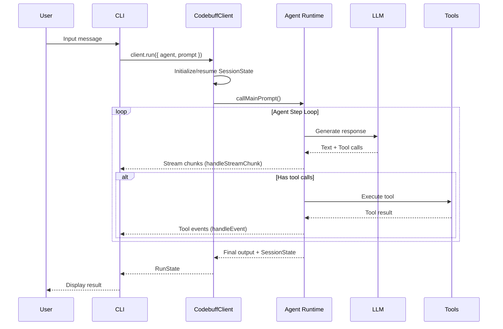
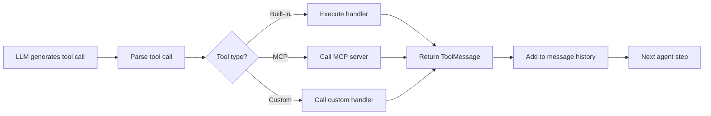

# Codebuff Multi-Agent System Specification

This document describes how the Codebuff multi-agent system works from the CLI perspective. It covers the architecture, message flow, agent orchestration, and key APIs for external users building on the SDK.

## Table of Contents

1. [Architecture Overview](#architecture-overview)
2. [Request Flow: CLI to Agents](#request-flow-cli-to-agents)
3. [Agent Hierarchy and Spawning](#agent-hierarchy-and-spawning)
4. [Tool Execution Model](#tool-execution-model)
5. [Message Types and Flow](#message-types-and-flow)
6. [Event Streaming System](#event-streaming-system)
7. [Session State and Resumption](#session-state-and-resumption)
8. [Parallel vs Sequential Execution](#parallel-vs-sequential-execution)
9. [Token Scoring System](#token-scoring-system)
10. [MCP Server Integration](#mcp-server-integration)

---

## Architecture Overview

The Codebuff system is organized in layers:

```
┌─────────────────────────────────────────────────────────────────┐
│                     CLI (User Interface)                        │
│                      cli/src/                                   │
└────────────────────────┬────────────────────────────────────────┘
                         │
┌────────────────────────▼────────────────────────────────────────┐
│               SDK (CodebuffClient - Public API)                 │
│                      sdk/src/                                   │
│              - client.ts (entry point)                          │
│              - run.ts (execution engine)                        │
└────────────────────────┬────────────────────────────────────────┘
                         │
┌────────────────────────▼────────────────────────────────────────┐
│            Agent Runtime (Core Execution Engine)                │
│              packages/agent-runtime/src/                        │
│         - main-prompt.ts (agent entry point)                    │
│         - run-agent-step.ts (stepping logic)                    │
│         - tools/ (tool handlers)                                │
└────────────────────────┬────────────────────────────────────────┘
                         │
┌────────────────────────▼────────────────────────────────────────┐
│              Agent Definitions & Tool System                    │
│                      agents/                                    │
│                      common/src/tools/                          │
└─────────────────────────────────────────────────────────────────┘
```

### Key Components

| Component | Location | Purpose |
|-----------|----------|---------|
| CLI | `cli/src/` | User interface, routes input, displays streaming output |
| SDK Client | `sdk/src/client.ts` | Public API for invoking agents |
| Run Engine | `sdk/src/run.ts` | Main execution orchestration, tool dispatch |
| Agent Runtime | `packages/agent-runtime/` | LLM calls, agent stepping, subagent spawning |
| Base2 Agent | `agents/base2/base2.ts` | Main orchestrator agent |
| Tools | `common/src/tools/` | Tool definitions and handlers |

---

## Request Flow: CLI to Agents



### Step-by-Step Flow

1. **User Input** → CLI receives user message
2. **Route** → `routeUserPrompt()` parses input (command or message)
3. **SDK Call** → `CodebuffClient.run()` invoked with agent and prompt
4. **Session Init** → Fresh `SessionState` created or previous state resumed
5. **Main Prompt** → `callMainPrompt()` starts the agent execution
6. **Agent Loop** → `loopAgentSteps()` iterates until completion:
   - LLM generates response (text + tool calls)
   - Tool calls executed via handlers
   - Results fed back to LLM
7. **Completion** → Final `RunState` returned with output and session state

---

## Agent Hierarchy and Spawning

Codebuff uses a hierarchical multi-agent architecture where parent agents spawn child agents to delegate work.

### Agent Tree Structure

```
Base2 (Main Orchestrator)
├── file-picker      (finds relevant files)
├── commander        (runs terminal commands)
├── code-searcher    (searches codebase)
├── researcher-web   (web research)
├── editor           (code editing)
├── thinker          (deep reasoning)
└── ... 20+ specialized agents
```

### Spawning Mechanism

Agents spawn children via the `spawn_agents` tool:

```typescript
// Parent agent yields spawn request
yield {
  toolName: 'spawn_agents',
  input: {
    agents: [
      {
        agent_type: 'code-searcher',
        prompt: 'Find all authentication logic',
        params: { searchQuery: 'auth' }
      },
      {
        agent_type: 'file-picker',
        prompt: 'Find test files'
      }
    ]
  }
}

// Results returned as array (same order as input)
// [
//   { agentType: 'code-searcher', value: {...} },
//   { agentType: 'file-picker', value: {...} }
// ]
```

### Context Passing

| Direction | Mechanism | Control |
|-----------|-----------|---------|
| Parent → Child | `prompt` and `params` fields | Always passed |
| Parent → Child | Message history | `includeMessageHistory: true` |
| Parent → Child | System prompt | `inheritParentSystemPrompt: true` |
| Child → Parent | Tool result structured output | `outputMode` config |

---

## Tool Execution Model

### Tool Call Lifecycle



### Built-in Tools

Core tools available to agents:

| Tool | Purpose |
|------|---------|
| `read_files` | Read file contents |
| `write_file` | Create/overwrite files |
| `str_replace` | Edit files with string replacement |
| `run_terminal_command` | Execute shell commands |
| `code_search` | Search codebase with patterns |
| `glob` | Find files by pattern |
| `list_directory` | List directory contents |
| `spawn_agents` | Invoke subagents |
| `end_turn` | Signal completion |

### Tool Handlers

Tool execution in `sdk/src/run.ts`:

```typescript
async function handleToolCall({ action, overrides, cwd, fs }) {
  const { toolName, input } = action

  // Check for MCP tool
  if (action.mcpConfig) {
    return await callMCPTool(mcpClientId, { name: toolName, arguments: input })
  }

  // Check for custom tool override
  if (overrides[toolName]) {
    return await overrides[toolName](input)
  }

  // Execute built-in tool
  switch (toolName) {
    case 'write_file':
    case 'str_replace':
      return await changeFile({ parameters: input, cwd, fs })
    case 'run_terminal_command':
      return await runTerminalCommand({ ...input, cwd })
    // ... other tools
  }
}
```

### Tool Result Format

```typescript
type ToolResultOutput =
  | { type: 'text', value: string }
  | { type: 'json', value: Record<string, any> }
  | { type: 'image', value: { base64: string, mimeType: string } }
```

---

## Message Types and Flow

### Message Structure

```typescript
type Message =
  | SystemMessage    // role: 'system' - agent instructions
  | UserMessage      // role: 'user' - user input (text/images/files)
  | AssistantMessage // role: 'assistant' - agent response (text/tool calls)
  | ToolMessage      // role: 'tool' - tool execution results
```

### Message History Flow

```
Step 1: [System] + [User "Fix the bug"]
        → LLM → [Assistant "I'll search..." + tool_call(code_search)]

Step 2: [System] + [User] + [Assistant] + [Tool result: {...}]
        → LLM → [Assistant "Found it, now editing..." + tool_call(str_replace)]

Step 3: [System] + [User] + [Assistant] + [Tool] + [Assistant] + [Tool result]
        → LLM → [Assistant "Done! The bug is fixed."]

Step 4: Agent completes, output returned to parent/user
```

---

## Event Streaming System

The SDK provides real-time streaming via callbacks:

### Callback Types

```typescript
type CodebuffClientOptions = {
  // Structured events (tool calls, subagent lifecycle)
  handleEvent?: (event: PrintModeEvent) => void | Promise<void>

  // Text chunks (streaming LLM output)
  handleStreamChunk?: (chunk: StreamChunk) => void | Promise<void>
}
```

### Event Types (PrintModeEvent)

| Event | Description |
|-------|-------------|
| `start` | Agent execution begins |
| `finish` | Agent execution completes |
| `text` | Text output from agent |
| `tool_call` | Tool invocation started |
| `tool_result` | Tool execution completed |
| `tool_progress` | Streaming tool output |
| `subagent_start` | Subagent spawned |
| `subagent_finish` | Subagent completed |
| `reasoning_delta` | Extended thinking output |
| `error` | Error occurred |

### Stream Chunk Types

```typescript
type StreamChunk =
  | string  // Direct text from main agent
  | {
      type: 'subagent_chunk'
      agentId: string
      agentType: string
      chunk: string
    }
  | {
      type: 'reasoning_chunk'
      agentId: string
      ancestorRunIds: string[]
      chunk: string
    }
```

### Event Flow Example

```
1. { type: 'start', agentId: 'main', model: 'claude-opus-4.5' }
2. "I'll help you fix that bug..."  (stream chunk)
3. { type: 'tool_call', toolName: 'spawn_agents', input: {...} }
4. { type: 'subagent_start', agentId: 'abc123', agentType: 'code-searcher' }
5. { type: 'subagent_chunk', agentId: 'abc123', chunk: "Searching..." }
6. { type: 'subagent_finish', agentId: 'abc123', agentType: 'code-searcher' }
7. { type: 'tool_result', toolName: 'spawn_agents', output: [...] }
8. "Found the issue! Now fixing..."  (stream chunk)
9. { type: 'tool_call', toolName: 'str_replace', input: {...} }
10. { type: 'tool_result', toolName: 'str_replace', output: [...] }
11. "Done! The bug is fixed."  (stream chunk)
12. { type: 'finish', agentId: 'main', totalCost: 0.05 }
```

---

## Session State and Resumption

### SessionState Structure

```typescript
type SessionState = {
  fileContext: ProjectFileContext  // Project metadata
  mainAgentState: AgentState       // Agent execution state
}

type AgentState = {
  agentId: string
  agentType: string | null
  messageHistory: Message[]        // Conversation history
  stepsRemaining: number           // Budget control
  creditsUsed: number              // Cost tracking
  contextTokenCount: number        // Token usage
  subagents: AgentState[]          // Child agent states
  // ... other fields
}

type ProjectFileContext = {
  projectRoot: string
  cwd: string
  fileTree: FileTreeNode[]
  fileTokenScores: Record<string, Record<string, number>>
  knowledgeFiles: Record<string, string>
  agentTemplates: Record<string, AgentTemplate>
  gitChanges: { status, diff, diffCached, lastCommitMessages }
  systemInfo: { platform, shell, nodeVersion, arch, homedir, cpus }
}
```

### RunState (SDK Return Type)

```typescript
type RunState = {
  sessionState?: SessionState  // State to resume from
  output: AgentOutput          // Agent's final output
}

type AgentOutput =
  | { type: 'structuredOutput', value: Record<string, any> }
  | { type: 'lastMessage', value: Message[] }
  | { type: 'allMessages', value: Message[] }
  | { type: 'error', message: string, statusCode?: number }
```

### Resumption Flow

```typescript
// First run
const result1 = await client.run({
  agent: 'base2',
  prompt: 'Help me refactor the auth module'
})

// Resume with follow-up
const result2 = await client.run({
  agent: 'base2',
  prompt: 'Now add tests for what you just changed',
  previousRun: result1  // Pass previous RunState
})
```

### What Gets Preserved

| Preserved | Description |
|-----------|-------------|
| Message history | Full conversation context |
| File context | Project structure, token scores |
| Agent state | Credits used, steps remaining |
| Knowledge files | Project documentation |

### What Gets Refreshed

| Refreshed | Description |
|-----------|-------------|
| Git changes | Re-computed on each run |
| Agent definitions | Can be overridden per-run |
| Max steps | Can be adjusted per-run |

---

## Parallel vs Sequential Execution

### Parallel Execution

Multiple subagents spawned in a single `spawn_agents` call execute in parallel:

```typescript
// These three agents run simultaneously
const result = await handleSpawnAgents({
  agents: [
    { agent_type: 'code-searcher', prompt: 'Find auth logic' },
    { agent_type: 'file-picker', prompt: 'Find test files' },
    { agent_type: 'researcher-web', prompt: 'Research OAuth 2.0' }
  ]
})

// Implementation uses Promise.allSettled
const results = await Promise.allSettled(
  agents.map(agent => executeSubagent(agent))
)
```

### Sequential Execution

Tool calls within a single agent step execute sequentially (one at a time). To enforce sequential subagent execution, spawn them in separate tool calls:

```typescript
// Sequential: spawn first, wait, spawn second
yield { toolName: 'spawn_agents', input: { agents: [agent1] } }
yield 'STEP'  // Continue agent execution
yield { toolName: 'spawn_agents', input: { agents: [agent2] } }
```

### Execution Patterns

```
┌─────────────────────────────────────────────────────────────┐
│                    Parallel Spawning                        │
│                                                             │
│  Parent Agent                                               │
│       │                                                     │
│       ├──spawn_agents([A, B, C])                           │
│       │                                                     │
│       ▼                                                     │
│  ┌─────────┬─────────┬─────────┐                           │
│  │ Agent A │ Agent B │ Agent C │  (run in parallel)        │
│  └────┬────┴────┬────┴────┬────┘                           │
│       │         │         │                                 │
│       └─────────┼─────────┘                                 │
│                 ▼                                           │
│         Results array                                       │
└─────────────────────────────────────────────────────────────┘

┌─────────────────────────────────────────────────────────────┐
│                   Sequential Spawning                       │
│                                                             │
│  Parent Agent                                               │
│       │                                                     │
│       ├──spawn_agents([A])                                 │
│       │       │                                             │
│       │       ▼                                             │
│       │   Agent A runs                                      │
│       │       │                                             │
│       │       ▼                                             │
│       │   Result A                                          │
│       │                                                     │
│       ├──spawn_agents([B])                                 │
│       │       │                                             │
│       │       ▼                                             │
│       │   Agent B runs (can use A's result)                │
│       │       │                                             │
│       │       ▼                                             │
│       │   Result B                                          │
└─────────────────────────────────────────────────────────────┘
```

### When to Use Each

| Pattern | Use When |
|---------|----------|
| Parallel | Independent tasks (search + research + lint) |
| Sequential | Dependent tasks (analyze → plan → implement) |
| Mixed | Some parallel (gather info), then sequential (apply changes) |

---

## Token Scoring System

Codebuff uses a token scoring system to help agents identify important symbols in the codebase.

### How It Works

1. **Parsing**: Project files are parsed using tree-sitter
2. **Symbol Extraction**: Functions, classes, variables extracted
3. **Scoring**: Symbols scored by reference count and importance
4. **Storage**: Scores stored in `fileTokenScores` in SessionState

### Data Structure

```typescript
type ProjectFileContext = {
  // Map: filePath -> { symbolName -> score }
  fileTokenScores: Record<string, Record<string, number>>

  // Map: symbolName -> { definingFile -> [callerFiles] }
  tokenCallers?: Record<string, Record<string, string[]>>
}
```

### Usage in Agents

Agents receive token scores in their context and can use them to:
- Prioritize which files to read
- Understand code structure
- Find related symbols across files

### Computation

Token scores are computed during session initialization:

```typescript
const { fileTokenScores, tokenCallers } = await computeProjectIndex(
  cwd,
  projectFiles
)
```

---

## MCP Server Integration

Agents can extend their capabilities through Model Context Protocol (MCP) servers.

### Configuration

MCP servers are defined in agent definitions:

```typescript
const agentDefinition: AgentDefinition = {
  id: 'my-agent',
  mcpServers: {
    notion: {
      type: 'stdio',
      command: 'npx',
      args: ['-y', '@notionhq/mcp-server'],
      env: {
        NOTION_TOKEN: '$NOTION_TOKEN'  // Read from .env
      }
    },
    database: {
      type: 'sse',
      url: 'https://my-mcp-server.com/sse'
    }
  },
  toolNames: [
    'read_files',           // Built-in tool
    'notion/search',        // MCP tool (server/tool format)
    'notion/create_page'    // Another MCP tool
  ]
}
```

### MCP Config Types

```typescript
type MCPConfig =
  | {
      type?: 'stdio'
      command: string
      args?: string[]
      env?: Record<string, string>  // $VAR reads from .env
    }
  | {
      type: 'sse'
      url: string
    }
```

### Tool Name Resolution

- Built-in tools: `'read_files'`, `'write_file'`, etc.
- MCP tools: `'serverName/toolName'` format
- If no `/` in name, assumes built-in tool

### MCP Tool Execution

```typescript
// When agent calls an MCP tool
if (action.mcpConfig) {
  const mcpClientId = await getMCPClient(action.mcpConfig)
  const result = await callMCPTool(mcpClientId, {
    name: actualToolName,
    arguments: input
  })
  return { output: result }
}
```

---

## Key Files Reference

| Purpose | File |
|---------|------|
| SDK Entry | `sdk/src/client.ts` |
| Run Engine | `sdk/src/run.ts` |
| Session State | `sdk/src/run-state.ts` |
| Agent Runtime | `packages/agent-runtime/src/main-prompt.ts` |
| Agent Stepping | `packages/agent-runtime/src/run-agent-step.ts` |
| Spawn Agents | `packages/agent-runtime/src/tools/handlers/tool/spawn-agents.ts` |
| Base2 Agent | `agents/base2/base2.ts` |
| Event Types | `common/src/types/print-mode.ts` |
| Session Types | `common/src/types/session-state.ts` |
| Tool Constants | `common/src/tools/constants.ts` |
| Agent Definition | `common/src/templates/initial-agents-dir/types/agent-definition.ts` |

---

## SDK Usage Example

```typescript
import { CodebuffClient } from '@codebuff/sdk'

const client = new CodebuffClient({
  apiKey: process.env.CODEBUFF_API_KEY,
  cwd: '/path/to/project',

  // Stream events
  handleEvent: (event) => {
    if (event.type === 'tool_call') {
      console.log(`Tool: ${event.toolName}`)
    }
  },

  // Stream text
  handleStreamChunk: (chunk) => {
    if (typeof chunk === 'string') {
      process.stdout.write(chunk)
    }
  }
})

// Run agent
const result = await client.run({
  agent: 'base2',
  prompt: 'Add error handling to the API endpoints'
})

// Check result
if (result.output.type === 'error') {
  console.error(result.output.message)
} else {
  console.log('Success!')
}

// Resume conversation
const result2 = await client.run({
  agent: 'base2',
  prompt: 'Now add tests for those changes',
  previousRun: result
})
```
